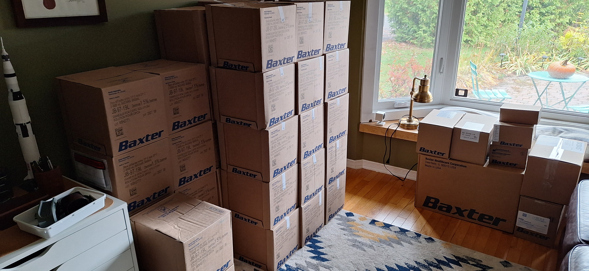
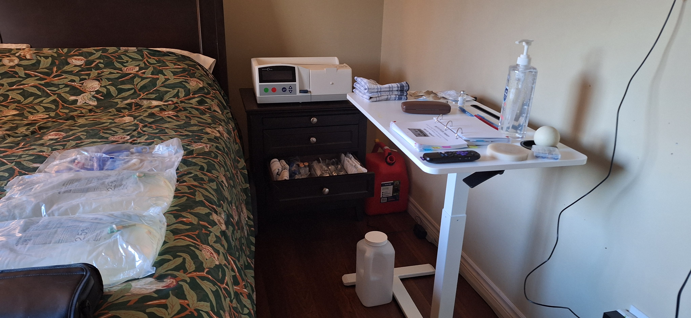

+++
date = '2025-10-25T15:02:46-04:00'
draft = false
title = 'Cycler at home'
description = "Yeah, I've been busy"
tags = ['transplant', 'dialysis']
weight = 2025
+++

So, last week I was on [dialysis training](http://www.mikeneedsakidney.ca/posts/dialysis_training/),
and now it's the weekend. On friday, my dialysis supplies were delivered and my
cycler machine was set up in my bedroom.

The nice guys who delivered my supplies carried them into my office for me, as
I specified. And damn, did they deliver a lot of stuff.

The initial order was put in by the nurses, and they are teaching me how to
submit follow-up orders myself. I'm using a lot of google calendar. And there is
so much stuff that it's overwhelming, but luckily my wife is good at organizing
stuff. While we were in the hospital being taught, she was making lists and
ordering shit on Amazon. We stopped by a dollar store for some organizational
compartments for drawers, and now my bed's end-table is very well organized. 

She's kind of impressive that way. And in other ways not relevant to this post.

At this point, I've gone through two nights of dialysis on the cycler, and I'm
slowly figuring it out. They have me tracking my vitals, and the difference is
already a bit shocking. In two days I've dropped roughly 3kg, and my blood
pressure has dropped from about 150/95 to 110/85. That is simply due to shedding
excess water from my body that my failing kidneys were not purging. Kind of
amazing really. 

Inconvenient? Hell yes. But I'm alive. Now to get my energy back so I can use
this time to improve my lousy fitness level and increase my chances. 

If you're still reading, thanks, especially if you were born after 1999. I
didn't even provide a TL;DR. 
