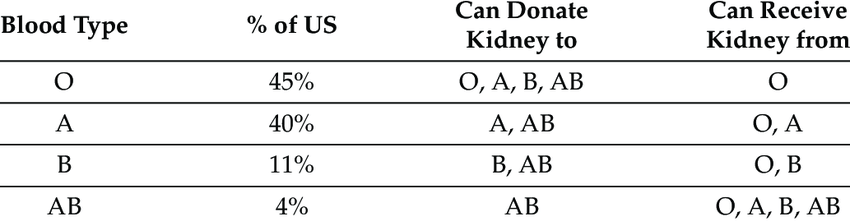

+++
date = '2026-05-24T17:25:44-04:00'
draft = true
title = 'Donation matrix'
description = "Compatibility anyone?"
tags = ['transplant']
weight = 2025
+++

I was curious about compatibility in donation, so I looked into it. It starts
with your blood type. I found this matrix online:

Granted, it's from the U.S., but I suspect that the distribution in Canada is
about the same. My blood type is A+, and I'm told that puts me in the best
category for compatibility.

Even so, I keep hearing, "at least two years." *sigh*
